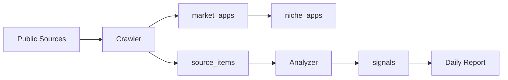

# Data Model

The first IndieRadar data model is centered around a market niche. Every collected item should eventually help explain what changed in a niche during the last day.

## Core Entities

### `niches`

A tracked market category, such as Habit Tracker, Finance, AI Chat, or Productivity.

This is the main product object.

### `sources`

A configured public data source:

- Google Play;
- App Store;
- Reddit;
- Product Hunt;
- Hacker News;
- RSS / news.

The `config` field keeps source-specific settings as JSON while the MVP is still evolving.

### `canonical_apps`

Product-level app identity used to connect the same app across stores.

Example:

- `Forest` as a canonical app;
- Google Play listing for `cc.forestapp`;
- App Store listing for the same product.

The first MVP matcher uses normalized app name plus normalized developer. This is intentionally conservative and can be improved later with websites, bundle IDs, icons, and manual review.

### `market_apps`

Known mobile apps from supported marketplaces.

Supported platforms now include `google_play` and `app_store`. Each row represents a marketplace listing and can point to a shared `canonical_apps` row.

### `niche_apps`

Links apps to niches and marks whether an app is a current leader or a candidate discovered by the crawler.

### `crawl_runs`

Execution records for crawler jobs. They make it possible to inspect what ran, when it ran, and whether it failed.

### `source_items`

Raw or near-raw items collected from external sources.

Examples:

- Google Play app page snapshot;
- App Store app page snapshot;
- Reddit post;
- Product Hunt launch;
- Hacker News discussion;
- RSS article.

Use this table to preserve source evidence before interpretation.

### `app_market_snapshots`

Append-only daily snapshots of marketplace metrics (score, version, reviews count) per app×market. Written after crawl for apps linked via `niche_apps`. Used for future trend reports; not read by the daily brief.

### `niche_theme_weekly_rollups`

Weekly aggregates of review theme mentions per app×market. Built by the Sunday rollup job from `source_items` (with a `signals` fallback). Used for future trend reports.

### `signals`

Normalized report-ready events for a niche.

Examples:

- new app appeared;
- leader app updated;
- important review theme emerged;
- Reddit discussion is relevant;
- Product Hunt launch is relevant;
- news item is relevant.

Daily reports should read from `signals`, not directly from raw `source_items`.

## Data Flow

## MVP Rules

- Keep `source_items.raw` for source-specific payloads that are not stable enough for first-class columns yet.
- Add first-class columns only when the field is used by querying, reporting, or deduplication.
- Treat `signals` as the stable input for daily reports.
- Keep `importance` simple: `1` is low signal, `5` is high signal, `3` is default.
- Do not add user accounts, billing, AI recommendations, or own-app monitoring tables until the MVP daily report works.

## First Queries To Support

- List active sources by type.
- List leader apps for a niche.
- Record a crawler run and its collected source items.
- Upsert a discovered Google Play app.
- Upsert a discovered App Store app.
- Match marketplace listings into a canonical app.
- Create report-ready signals for a niche and date range.
- Read all signals for one niche ordered by `occurred_at`.
